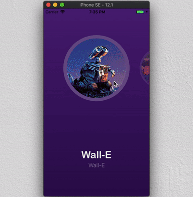
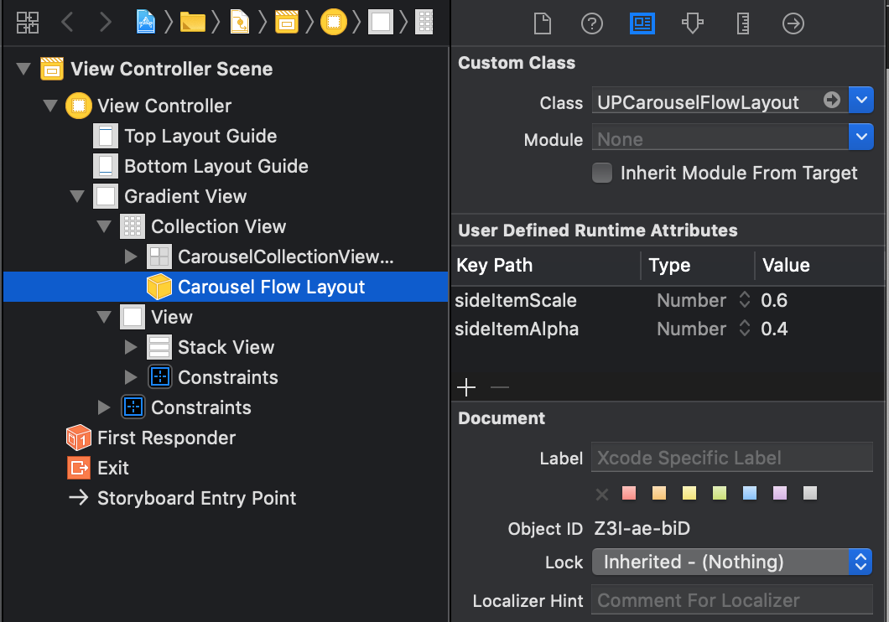

UPCarouselFlowLayout
===============

`UPCarouselFlowLayout` is a fancy carousel flow layout for `UICollectionView`. It comes with a paginated effect and it shrinks and makes transparent the side items.



## Requirements

- iOS 8.1+

## Installation

### CocoaPods

`UPCarouselFlowLayout` is available through [Nuget](http://nuget.org). To install
it, simply add the following line to your Podfile:

```
Install-Package UPCarouselFlowLayout
```

### Manual

Simply copy the folder `UPCarouselFlowLayout` to your project and reference to the `UPCarouselFlowLayout.csproj`.

## Usage

### Getting Started

##### Via code

```csharp
using UPCarouselFlowLayout
```

Create a `UPCarouselFlowLayout` object, set its `ItemSize` and assign it to your `UICollectionView`.

```csharp
var layout = new UPCarouselFlowLayout
{
    ItemSize = new CGSize(200, 200)
};
CollectionView.CollectionViewLayout = layout;
```

##### Via Interface Builder

Set the `UICollectionView` layout class to `UPCarouselFlowLayout`, and set its `ItemSize` and its properties.



### Properties

`UPCarouselFlowLayout` has a few customizable properties:

* `SideItemScale` (between 0 and 1, default is 0.6)
*Can be set through code or via Interface Builder.*
The shrinking ratio for collection items which are not in the center.

* `SideItemAlpha` (between 0 and 1, default is 0.6)
*Can be set through code or via Interface Builder.*
The opacity ratio for collection items which are not in the center.

* `SideItemShift` (value in pixels, default is 0)
*Can be set through code or via Interface Builder.*
A vertical/horizontal offset (depending on the collectionView scroll direction) for collection items which are not in the center.

* `SpacingMode` (default is fixed spacing of 40 pts)
*Can be set only through code.*(`SetSpacingMode`)
  * `UPCarouselFlowLayoutSpacingMode.Fixed`
Items in the carousel are positioned with a fixed space between them.
  * `UPCarouselFlowLayoutSpacingMode.Overlap`
A fixed part of the side items are visible on the sides of the collection (and therefore the space between items depends on the collection size).


## License

`UPCarouselFlowLayout` is released under the MIT license.
See [LICENSE](./LICENSE) for details.
